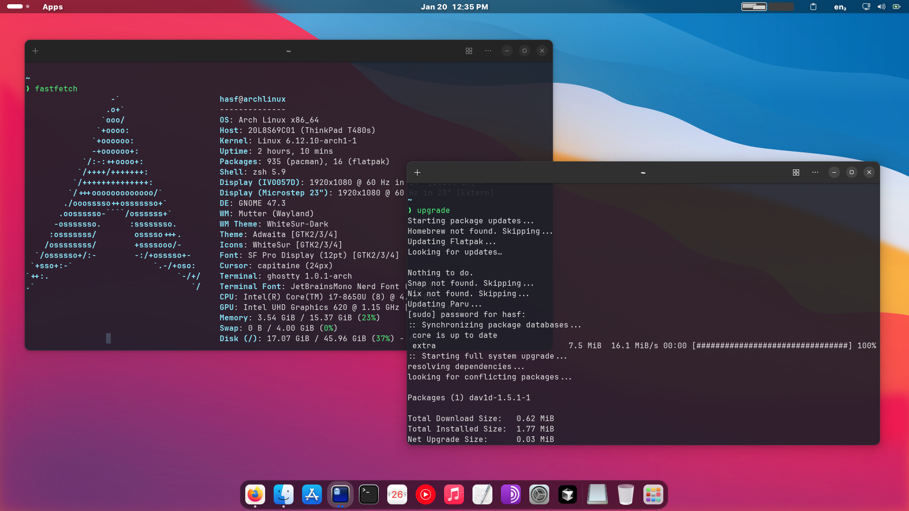

# Universal Package Updater

The **Universal Package Updater** is a powerful, all-in-one script designed to automate updates across multiple package managers. Whether you're using **Homebrew**, **Flatpak**, **Nix**, **Paru**, **Yay**, or system-level package managers like **apt**, **dnf**, **pacman**, this script ensures your system is up-to-date effortlessly.

## Why Use Universal Package Updater?
- **Comprehensive Shell Support**: Works seamlessly with Zsh, Bash, Fish, NuShell, Korn Shell, C Shell, Dash, Elvish, Xonsh, and BusyBox.
- **Time-Saving**: Updates all supported package managers with a single command.
- **User-Friendly**: Easy to set up and use, even for beginners.
- **Customizable**: Tailored to detect your shell environment and install the relevant script.
- **Lightweight**: Minimal resource usage while handling essential updates.

---

## Key Features
- Updates popular package managers:
  - **System Package Managers**: apt, dnf, pacman, zypper, xbps, apk, slackpkg, guix
  - **Universal Package Managers**: Homebrew, Flatpak, Snap, Nix
  - **AUR Helpers**: Paru, Yay
  - **Programming Language Package Managers**: 
    - npm, yarn, pnpm (Node.js)
    - pip, poetry, conda (Python)
    - gem, bundle (Ruby)
    - composer (PHP)
    - cargo (Rust)
    - go get (Go)
    - maven, gradle (Java)
    - cabal, stack (Haskell)
    - cpan (Perl)
    - luarocks (Lua)
  - **Container Tools**: Docker, Podman, Singularity
  - **Development Tools**: Minikube
- Automatic cleanup after updates to free up disk space
- Compatible with multiple shell environments

---

## Installation Guide

### Step 1: Clone the Repository
Clone the repository into your system:

```bash
# Latest version
git clone https://github.com/fernand3z/update-script.git
# OR specific version (recommended)
git clone --branch v2.0.0 https://github.com/fernand3z/update-script.git
cd update-script
```

### Step 2: Run the Installation Script
The installation script automatically detects your shell and installs the corresponding script:

`I.` Run the command to make `install.sh` executable.
```bash
chmod +x install.sh
```
`II.` Run the command to install
```bash
./install.sh
```

- The appropriate script will be copied to `~/scripts/update_packages`.
- If your shell is not detected, manually choose the script from the `scripts/` folder.

### Step 3: Add Alias to Your Shell Configuration
To simplify usage, add an alias to your shell configuration file:

#### For Zsh:
```zsh
# Add to ~/.zshrc
alias upgrade="~/scripts/update_packages"
```

#### For Bash:
```bash
# Add to ~/.bashrc or ~/.bash_profile
alias upgrade="~/scripts/update_packages"
```

#### For Fish:
```fish
# Add to ~/.config/fish/config.fish
alias upgrade="~/scripts/update_packages"
```

#### For NuShell:
```nu
# Add to ~/.config/nushell/config.nu
alias upgrade = ~/scripts/update_packages
```

#### For Korn Shell (KSH):
```ksh
# Add to ~/.kshrc
alias upgrade="~/scripts/update_packages"
```

#### For C Shell (CSH):
```csh
# Add to ~/.cshrc
alias upgrade ~/scripts/update_packages
```

#### For Dash:
```sh
# Add to ~/.dashrc or ~/.profile
alias upgrade="~/scripts/update_packages"
```

#### For Elvish:
```elvish
# Add to ~/.elvish/rc.elv
fn upgrade { ~/scripts/update_packages }
```

#### For Xonsh:
```python
# Add to ~/.xonshrc
aliases['upgrade'] = '~/scripts/update_packages'
```

#### For BusyBox:
```sh
# Add to ~/.profile or /etc/profile
alias upgrade="~/scripts/update_packages"
```

#### For POSIX Shell:
```sh
# Add to ~/.profile
alias upgrade="~/scripts/update_packages"
```

After adding the alias, reload your shell configuration:

```bash
# For Zsh
source ~/.zshrc

# For Bash
source ~/.bashrc  # or source ~/.bash_profile

# For Fish
source ~/.config/fish/config.fish

# For NuShell
source ~/.config/nushell/config.nu

# For KSH
source ~/.kshrc

# For CSH
source ~/.cshrc

# For Dash/POSIX/BusyBox
. ~/.profile

# For Elvish
exec elvish

# For Xonsh
source ~/.xonshrc
```

### Step 4: Run the Script
Use the `upgrade`command to update all your package managers effortlessly:

```bash
upgrade
```
### Remove the Script

```bash
rm -rf ~/scripts ~/update-script
```
---

##  Benefits

### **Automate Package Manager Updates with Ease**
The Universal Package Updater streamlines the process of keeping your tools and system updated. Say goodbye to manually running multiple commands for each package manager. Our script does the heavy lifting for you.

### **Supports Multiple Environments**
Whether you're a macOS, Linux, or Arch Linux user, this script has you covered. It's perfect for developers, sysadmins, and tech enthusiasts.

### **Simplify System Maintenance**
No more forgetting to update a package manager. Keep your system clean and secure with built-in cleanup routines and regular updates.

### **Optimized for Developers**
Developers often juggle multiple environments and package managers. This script simplifies your workflow, ensuring all your tools are up-to-date with a single command.

---

## Folder Structure

```plaintext
update-script/
├── scripts/
│   ├── update_packages.zsh
│   ├── update_packages.fish
│   ├── update_packages.nu
│   ├── update_packages.sh
│   ├── update_packages.ksh
│   ├── update_packages.csh
│   ├── update_packages.dash
│   ├── update_packages.elv
│   ├── update_packages.xsh
│   ├── update_packages.bbsh
│   └── update_packages.posix.sh
├── install.sh
└── README.md
```

---

## Contributing
Contributions are welcome! If you have ideas for improvements or want to add support for more package managers, feel free to fork the repository and submit a pull request.

---

## License
This project is licensed under the [MIT License](LICENSE).

---

## Screenshot


---

## Keywords
- **Update Package Managers Automatically**
- **All-in-One Update Script**
- **Cross-Shell Package Manager Updater**
- **Automate System Updates**
- **Best Linux Package Updater**
- **Homebrew, Flatpak, Nix, APT, DNF Updates**
- **Effortless Software Updates**
- **Developer-Friendly Update Tool**

## Supported Package Managers

### System Package Managers
- APT (Debian/Ubuntu)
- DNF (Fedora)
- Pacman (Arch)
- Zypper (openSUSE)
- Portage (Gentoo)
- XBPS (Void Linux)
- APK (Alpine)
- Slackpkg (Slackware)
- Guix

### Universal Package Managers
- Homebrew
- Flatpak
- Snap
- Nix

### Programming Languages
- Node.js (npm, yarn, pnpm)
- Python (pip, poetry, conda)
- Ruby (gem, bundle)
- PHP (composer)
- Rust (cargo)
- Go
- Java (maven, gradle)
- Haskell (cabal, stack)
- Perl (cpan)
- R
- Lua (luarocks)

### Container and Virtualization
- Docker
- Podman
- Singularity
- Minikube
